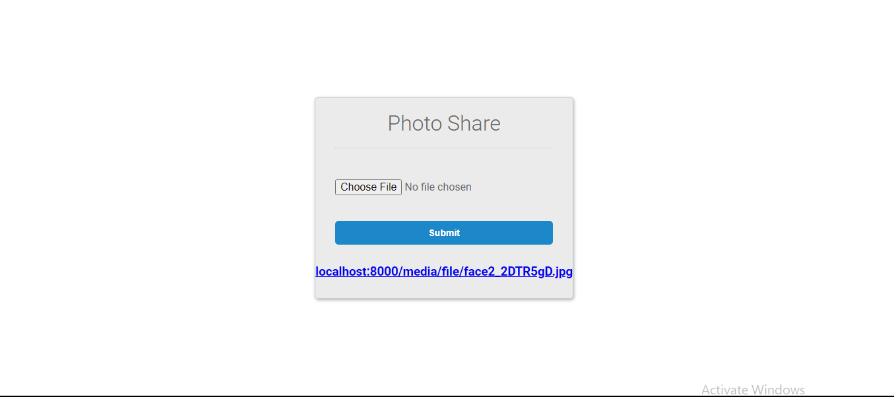

<h1 align="center">FileSharing Django WebApp</h1>
<p>
">
">
">
">
</p>

---
The FileSharing Django WebApp, is just basically uploading files to the database using python and the django framework.

---
## Getting started with development
---
Creating a photoshare app with Django

Installation

You can download the Python software by visiting this link
`https://www.python.org/downloads/release/python-372/` or you can download the Miniconda(a free minimal installer for conda. It is a small version of Anaconda) by visiting this link
`https://conda.io/en/latest/miniconda.html`

Type on your cmd `pip install django` to install django.

### 1. Clone this repository
```
git clone https://github.com/AmucheOgbonna/Diango_project.git
cd filesharing
```

### 2. Create the virtualenv

Setting up a Virtual Environment
To use a virtual environment with conda we use these commands:

`conda create --name my_django_env python`

Here we created an environment called <b>my_django_env'</b> with the latest version of
Django.
You can then activate the environment using the command: 

`activate my_django_env`

---
### 3. Run development server

`python manage.py runserver` to run server and open and view FileSharing Django WebApp.

## Preview

<p></p>

<!--## Contributors

* [Akash Giri](https://github.com/akashgiricse)

## Support

* If you are having issues, please let me know.<gr>
I have a mailing list located at: contact@akashgiri.com
-->

